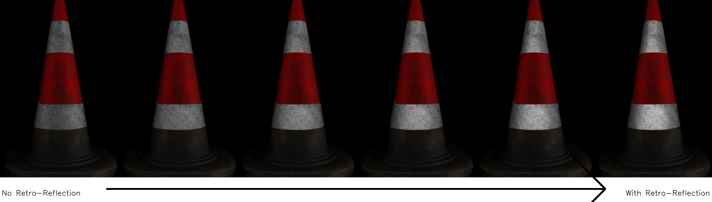

## Introduction

This repository contain unofficial implementation of the paper "A retroreflective BRDF model based on prismatic sheeting and microfacet theory" (Guo et al., 2018).([link](https://www.sciencedirect.com/science/article/abs/pii/S1524070318300018)).




## Setup
```
# install requirements
pip install numpy imageio tqdm
# install mitsuba
pip install mitsuba
```

## Test
```
python val_render.py
```
